# Time Tracker | React

Time tracker is a cloud based task manager where you can manage your tasks in your mobile or web browser in a same time or in a most appropriate way, **Real-time**.

## How?

The Back-End for both web and mobile platform is by **Google Firebase services**. So there is no worry about missing data, authentication and any other things.

## Mobile application

Mobile app is created with Flutter and it is also open source. You can see it from these links:

- [Github source](https://github.com/BlackIQ/TimeTracker-Flutter)
- > APK is not available, It will be release today.

## Firebase

Firebase is a cloud service provider for many frameworks. Like **Authentication**, **Cloud Firestore** and **Hosting**.

### Authentication

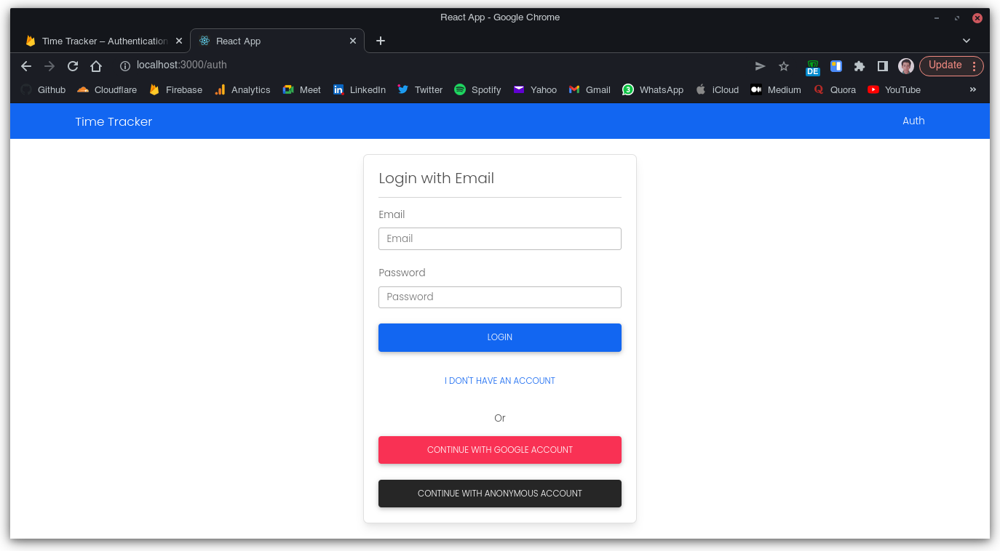

Authentication with Firebase is so easy. You can turn on Auth providers in your project part in Firebase and add their methods in your source project.

Our application has 3 ways to authenticating.

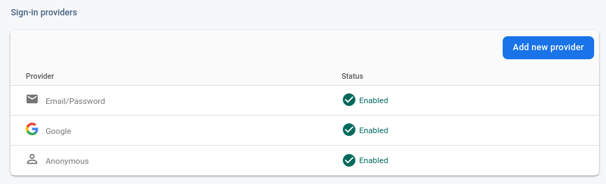

In the Firebase authentication part, there is a part you can see users and the uid.

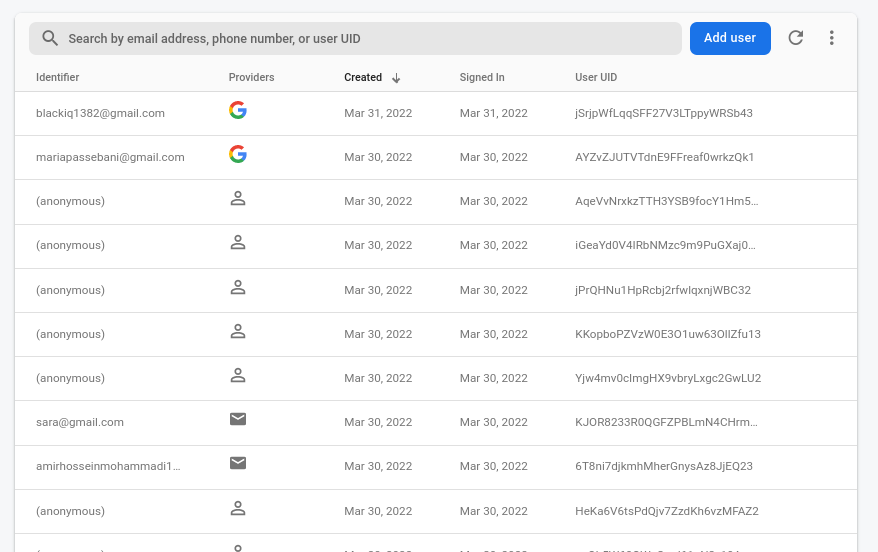

#### Email & Password Authentication

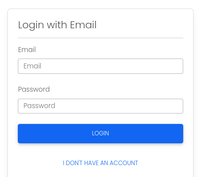 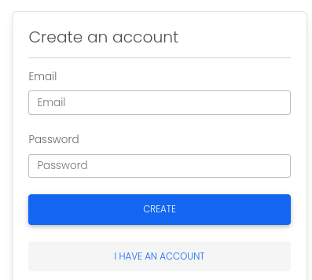

You can use your Email and Password to register or login. There is also a way to reset your password.

#### Google Authentication

If you have a Google account, you can easily authenticate with your Google account.

#### Anonymous Authentication

If you want to use the app as a guest or testing app, you can use Anonymous authentication where you don't need to have any Google account or any other emails.

### Firestore

As we said before, we save data in **Firestore**. Firestore is a NoSQL database, there are 2 collections that I will describe them.

#### Tasks collection

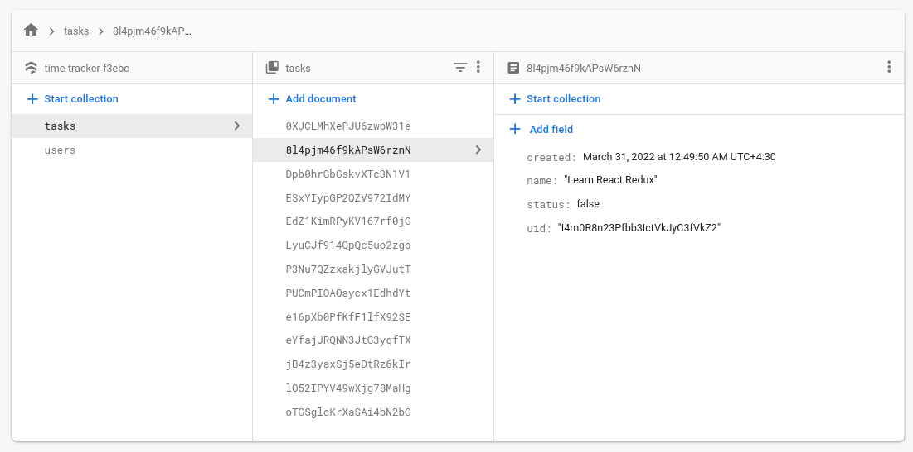

In this collection, there are task documents. Every document has 4 keys. Like a Json file.

```json
{
  "uid": "user uid",
  "status": true,
  "created": "Time stamp",
  "name": "Task name"
}
```

The `status` can be `true` or `false`.

#### Users collection

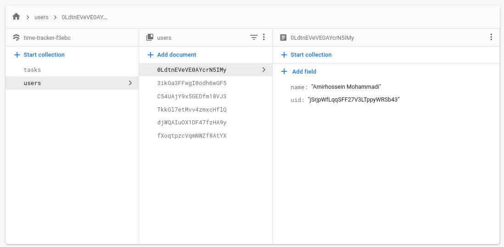

There are only 2 items that store in users collection.

```json
{
  "user": "user id",
  "name": "user name"
}
```

If user authenticate with Google account, the `name` will be your Google account name. If not, the `null` will be store in that field.

> Name can change in your panel.

### Hosting

App is hosting in **Firebase Hosting**. More details are described in the end of the document.

## Application components

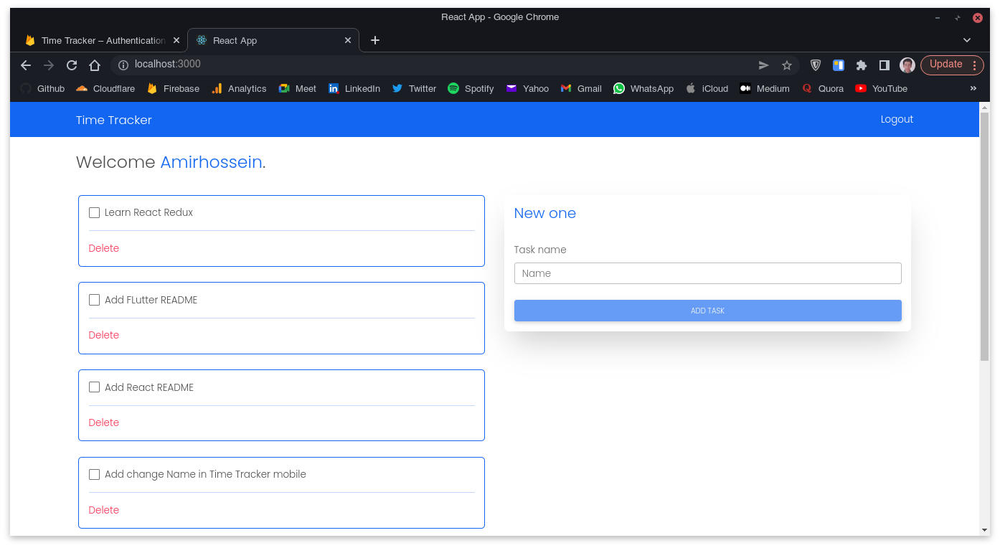

Application user panel has 3 components. A navbar, Task component and adding task component.

### Adding task component

Validation for adding task is the mos simple way. It check the value of input and if it is not null, the button will be enabled.

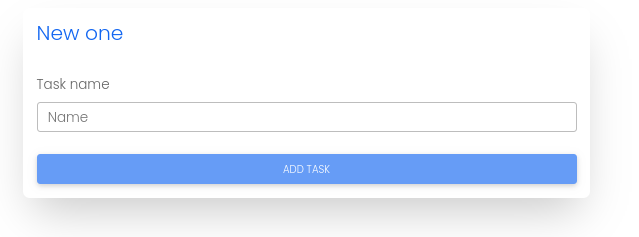 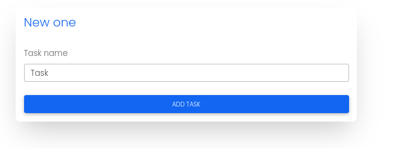

### Task component

Task component contains a checkbox that shows that task is done or not. Inside of checkbox, there is task name. To delete a task, there is a delete span that has an onClick event.

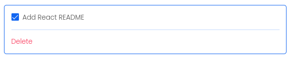 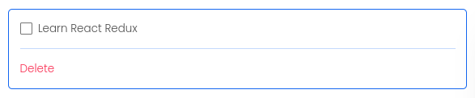

## Application deployment

This app is running in **Firebase Hosting** and you can access to it via [this link](time-tracker-f3ebc.firebaseapp.com) or [this link](time-tracker-f3ebc.web.app).
